# 🏦 ChurnCtrl

## Predictive Banking Customer Churn Analysis and Retention Insights Platform

End-to-End Data Analytics + Machine Learning project analyzing banking customer churn across **10,000 customer records and 14 features**.

Combines **Python, SQL, statistical analysis, machine learning, automated AI insights, and an interactive Streamlit dashboard** to identify churn drivers, predict at-risk customers, and support retention decisions.

---

## 🎯 Business Problem

A bank has identified an overall customer churn rate of **20.37%** and is concerned about its impact on revenue, since acquiring new customers costs significantly more than retaining existing ones.

However, underlying churn drivers and high-risk customer segments remain unclear.

The analytics team needs to determine:

- Which customer segments have highest churn risk?
- Do multiple risk factors compound churn risk?
- Are observed differences statistically significant?
- Does financial behavior relate to churn?
- Can customers at risk be identified in advance?
- Which factors matter most for prediction?
- Can insights and recommendations be generated automatically?
- Can findings be presented through an interactive dashboard?

---

## 🏗️ Project Architecture

```mermaid
flowchart LR
    A[Banking Customer Dataset<br/>10,000 Records • 14 Features]
    B[Python / Pandas<br/>Data Loading & EDA]
    C[Data Preparation<br/>Cleaning • Validation • Transformation]
    D[(PostgreSQL<br/>Customer Data)]
    E[SQL Business Analysis<br/>Churn Segmentation]
    F[Statistical Analysis<br/>Significance Testing]
    G[Machine Learning<br/>Churn Prediction]
    H[Random Forest<br/>Classification Model]
    I[Groq<br/>Automated Business Insights]
    J[Streamlit Dashboard<br/>Interactive Analytics]
    K[Live Churn Predictor]

    A --> B
    B --> C
    C --> D
    D --> E
    E --> F
    F --> G
    G --> H
    H --> I
    I --> J
    J --> K
```




---

## 📊 Dataset

- **Records:** 10,000
- **Features:** 14
- **Target variable:** `Exited`

### Key Features

- Geography
- Gender
- Age
- Credit Score
- Tenure
- Account Balance
- Number of Products
- Credit Card Status
- Active Membership Status
- Estimated Salary
- Customer demographics
- Account information
- Customer activity
- Churn status

### Target Variable

```text
Exited
```

Represents whether customer has churned.

---

## 🛠️ Tools & Technologies

| Technology | Purpose |
|---|---|
| Python | Data analysis, preprocessing, machine learning |
| Pandas | Data manipulation & preprocessing |
| NumPy | Numerical analysis |
| PostgreSQL | Database storage & SQL analysis |
| SQL | Business analysis & segmentation |
| Scikit-learn | Statistical analysis & machine learning |
| Random Forest | Churn classification |
| Plotly | Interactive visualizations |
| Streamlit | Interactive dashboard |
| Groq | Automated business insights |
| Joblib | Model & scaler serialization |
| GitHub | Version control & documentation |

---

## 🔄 Project Workflow

```text
Raw Banking Customer Dataset
        ↓
Python / Pandas
        ↓
Data Exploration & Preparation
        ↓
PostgreSQL
        ↓
SQL Business Analysis
        ↓
Statistical Analysis
        ↓
Machine Learning
        ↓
Random Forest Churn Model
        ↓
Automated Business Insights
        ↓
Streamlit Dashboard
        ↓
Live Churn Prediction
```

---

# 1️⃣ Data Loading & Exploratory Data Analysis

Dataset initially loaded into Python using **Pandas**.

### Analysis Performed

- Dataset structure and data types
- Descriptive statistics
- Missing-value analysis
- Column inspection
- Churn distribution
- Customer demographics
- Account characteristics
- Financial characteristics
- Activity patterns
- Product usage
- Segment-level churn patterns

---

# 2️⃣ Data Cleaning & Preparation

Data preparation performed before SQL analysis and machine learning.

### Preparation Steps

- Data type validation
- Data consistency checks
- Feature inspection
- Target variable validation
- Numerical feature preparation
- Categorical feature preparation
- Model-ready dataset preparation

Processed customer data then used for SQL analysis, statistical analysis, and machine learning.

---

# 3️⃣ Database Integration

Processed customer data integrated with **PostgreSQL** for structured business analysis.

```text
PostgreSQL
    ↓
Customer Data
    ↓
SQL Business Analysis
    ↓
Churn Segmentation
    ↓
Risk Analysis
```

---

# 4️⃣ SQL Business Analysis

SQL used to investigate churn across customer characteristics and business dimensions.

### Key Analyses

#### 1. Churn by Geography

Compared churn patterns across customer locations.

#### 2. Churn by Gender

Analyzed differences in churn between male and female customers.

#### 3. Churn by Age

Investigated relationship between customer age and churn.

#### 4. Churn by Activity Status

Compared churn among active and inactive members.

#### 5. Churn by Number of Products

Examined relationship between product ownership and churn risk.

#### 6. Churn by Credit Score

Investigated credit-score patterns across churn status.

#### 7. Churn by Account Balance

Compared financial characteristics of churned and retained customers.

#### 8. Churn by Tenure

Analyzed relationship between customer tenure and churn.

#### 9. Customer Segment Analysis

Compared churn across combinations of customer characteristics.

#### 10. Compound Risk Analysis

Investigated whether combinations such as **female + German** customers show different churn behavior.

---

# 5️⃣ Statistical Analysis

Statistical analysis performed to determine whether observed differences across customer groups are statistically meaningful.

### Focus Areas

- Segment-level churn differences
- Statistical significance testing
- Relationships between customer attributes and churn
- Compound risk factors
- Financial behavior and churn
- Distinguishing meaningful patterns from random variation

Statistical testing provides additional evidence for interpreting observed churn patterns rather than relying only on descriptive differences.

---

# 6️⃣ Machine Learning — Churn Prediction

Classification-based machine learning pipeline developed to predict customer churn.

### Evaluation Metrics

- Accuracy
- Precision
- Recall
- F1 Score

### Model

```text
Random Forest Classifier
```

### Model Performance

| Metric | Score |
|---|---:|
| Accuracy | **87.05%** |
| Precision | **80.08%** |
| Recall | **48.40%** |
| F1 Score | **0.6034** |

### Model Artifacts

```text
models/
├── random_forest_churn_model.pkl
└── scaler.pkl
```

Trained model and preprocessing scaler stored as serialized artifacts and used by deployed prediction application.

---

# 7️⃣ Feature Importance

Feature importance analyzed to understand which customer characteristics contribute most to model predictions.

### Top Churn Driver

**Age — 22.4% feature importance**

Feature importance provides an interpretable connection between machine learning predictions and customer characteristics used during analysis.

---

# 8️⃣ Automated Business Insights

ChurnCtrl integrates **Groq** to convert analytical outputs into business-ready insights.

### Automated Output

- Key observations
- Churn-risk interpretations
- Business implications
- Retention recommendations

This connects analytical findings with stakeholder-facing business narratives while reducing repetitive manual reporting.

---

# 9️⃣ Streamlit Dashboard

Final analysis presented through an interactive **Streamlit dashboard**.

### 🌐 Live Application

https://churnctrl.streamlit.app/

### Dashboard Modules

- 🏠 **Home** — Project overview and business context
- 📊 **EDA Dashboard** — Interactive customer and churn analysis
- 📐 **Statistical Insights** — Statistical analysis and significance results
- 🤖 **Model Performance** — Model metrics and feature importance
- 🎯 **Live Churn Predictor** — Real-time customer churn prediction
- 💡 **Business Recommendations** — Automated insights and retention recommendations

### Dashboard Features

- Interactive churn analysis
- Customer segmentation
- Churn-driver visualization
- Statistical insights
- Model performance metrics
- Feature importance
- Live prediction
- Automated business recommendations
- Client-presentation-ready interface

---

# 🔟 Live Churn Predictor

Live Churn Predictor converts trained machine learning model into an interactive business-facing tool.

```text
Customer Attributes
        ↓
Data Preprocessing
        ↓
Scaler
        ↓
Random Forest Model
        ↓
Churn Prediction
```

Users can enter customer attributes and generate churn predictions through deployed Streamlit interface.

---

# 💡 Business Insights & Recommendations

## 🎯 Risk-Based Retention

Identify customer segments showing elevated churn risk and prioritize retention efforts accordingly.

## 👤 Age-Based Retention Analysis

**Age accounts for 22.4% of model feature importance**, making age an important factor for further churn segmentation and retention analysis.

## 🏦 Product & Activity Strategy

Analyze customers based on **number of products and activity status** to identify engagement patterns associated with churn.

## 🌍 Geographic Segmentation

Use geography-level churn patterns to identify locations requiring deeper investigation and potentially targeted retention strategies.

## 📊 Predictive Customer Prioritization

Use churn predictions to identify customers who may require proactive retention attention.

## 📐 Evidence-Based Decisions

Use statistical testing alongside descriptive analysis to avoid treating random variation as meaningful business patterns.

## 🤖 Automated Reporting

Use Groq-powered insight generation to convert analytical results into concise, business-ready observations and recommendations.

---

# 📁 Project Structure

```text
Banking Churn analysis and prediction/
│
├── .env
├── .gitignore
├── Churn_Modelling.csv
├── customers_bank_export.csv
├── export_to_csv.py
│
├── models/
│   ├── random_forest_churn_model.pkl
│   └── scaler.pkl
│
├── dashboard/
│   ├── .streamlit/
│   │
│   ├── pages/
│   │   ├── 2_EDA_Dashboard.py
│   │   ├── 3_Model_Performance.py
│   │   └── 4_Live_Churn_Predictor.py
│   │
│   └── Home.py
│
├── notebooks/
├── outputs/
├── sql/
├── src/
├── requirements.txt
└── README.md
```

---

# ▶️ How to Run

## 1. Clone Repository

```bash
git clone https://github.com/pranavvv44/ChurnCtrl.git
cd ChurnCtrl
```

## 2. Install Dependencies

```bash
pip install -r requirements.txt
```

## 3. Run Streamlit Dashboard

```bash
streamlit run dashboard/Home.py
```

Application opens locally through Streamlit.

---

# 🌐 Deployment

ChurnCtrl deployed using **Streamlit Community Cloud**.

### Live Application

https://churnctrl.streamlit.app/

---

# 📦 Project Deliverables

- 🐍 Python/Pandas data analysis
- 🧹 Data cleaning & preparation
- 🗄️ PostgreSQL database integration
- 🔎 SQL business analysis
- 📐 Statistical analysis
- 🤖 Machine learning churn prediction
- 🌲 Random Forest classification model
- 💾 Trained model & scaler artifacts
- 📊 Interactive Streamlit dashboard
- 🎯 Live churn prediction
- 🤖 Groq-powered automated insights
- 💡 Business recommendations

---

# 🚀 Key Skills Demonstrated

**Data Analysis • Data Cleaning • Exploratory Data Analysis • Python • Pandas • NumPy • SQL • PostgreSQL • Statistical Analysis • Machine Learning • Random Forest • Classification • Predictive Analytics • Feature Importance • Streamlit • Plotly • Customer Segmentation • Churn Analysis • Business Intelligence • Automated Analysis • AI Integration • Business Insights • Data Storytelling**

---

# 👤 Author

**Pranav Sharma**

**Data and Analytics Engineer | AI/ML Automated Analysis**

---

⭐ If you found this project useful, explore the **SQL analysis, statistical investigation, machine learning model, automated insights, and live Streamlit dashboard**.
````
